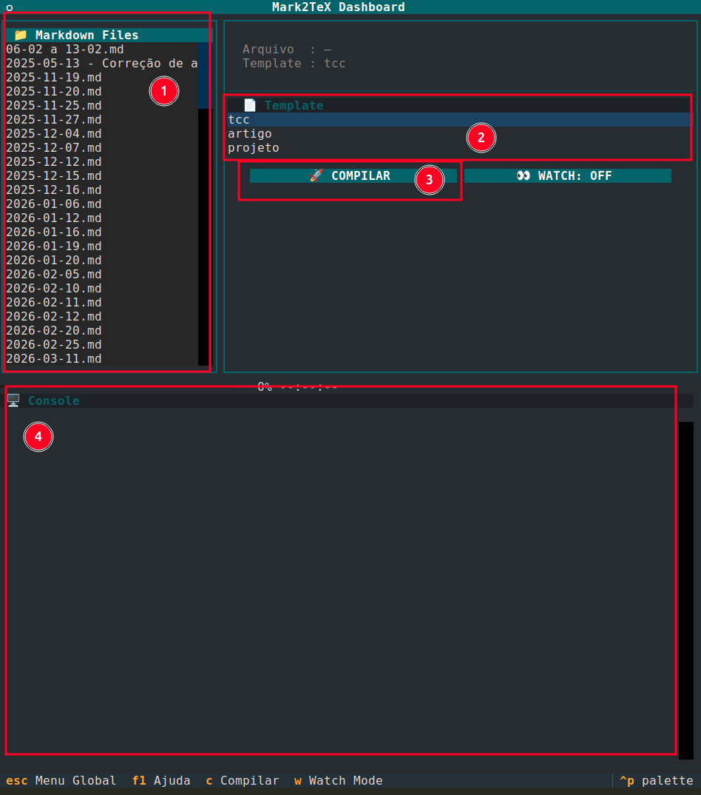
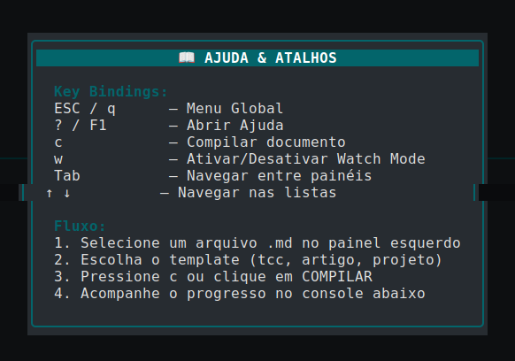
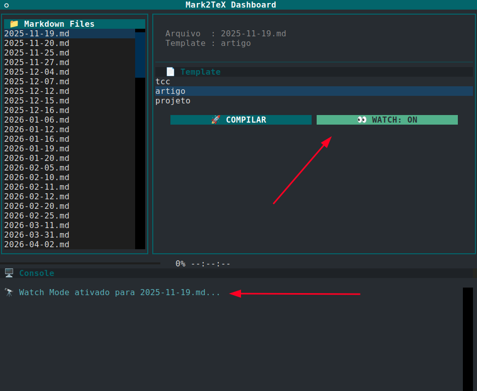

<p align="center">
  
</p>

<h1 align="center">Mark2TeX</h1>

<div align="center">
  <strong>🚀 Markdown para PDF acadêmico com ABNT, Docker e TUI interativa 🎓</strong><br>
  Uma ferramenta para escrever em Markdown e compilar documentos acadêmicos com templates LaTeX por meio de uma interface de terminal e um pipeline Dockerizado.
</div>

<br>

<div align="center">
  
  
</div>

<div align="center">
  <h3>
    <a href="#funcionalidades">
      ✨ Funcionalidades
    </a>
    <span> | </span>
    <a href="#instalação">
      🚀 Instalação
    </a>
    <span> | </span>
    <a href="#estrutura-do-projeto">
      📂 Estrutura
    </a>
    <span> | </span>
    <a href=".github/CONTRIBUTING.md">
      🤝 Contribuição
    </a>
  </h3>
</div>

<div align="center">
  <sub>Construído com ❤︎ por <a href="https://github.com/Hylbert">Hylbert</a> e contribuidores.</sub>
</div>

<br />

## ✨ Visão geral

O Mark2TeX separa escrita e formatação: o conteúdo fica em Markdown, enquanto a renderização final é feita por Pandoc, XeLaTeX e templates LaTeX dentro de um container Docker. A versão atual inclui uma TUI (Terminal User Interface) desenvolvida com Textual, oferecendo seleção de arquivos, escolha de templates, console de compilação em tempo real, watch mode e atalhos de teclado. 🖥️

## 🚀 Funcionalidades

- **🎓 Compilação ABNT**: Geração de PDFs com templates acadêmicos (`tcc`, `artigo`, `projeto`).
- **📦 Execução Isolada**: Pipeline via Docker, eliminando a necessidade de instalar distribuições TeX gigantescas localmente.
- **🎨 Interface TUI**: Dashboard interativo com lista de arquivos Markdown, barra de progresso e console de logs.
- **🔭 Watch Mode Integrado**: Recompilação automática do arquivo selecionado assim que ele é salvo.
- **🔍 Logs Inteligentes**: Tradução e filtragem de logs do LaTeX para tornar as mensagens de erro mais legíveis.
- **📚 Bibliografia Automática**: Suporte a BibTeX via `Pandoc` e `XeLaTeX`.

## 🛠️ Requisitos

Antes de usar o Mark2TeX, certifique-se de ter instalado:

- **🐍 Python 3.10** ou superior.
- **🐳 Docker** instalado e com o daemon em execução.
- **📦 pipx** (recomendado) para instalação do comando globalmente em ambiente isolado.

## 🚀 Instalação

### 🛠️ Instalação com pipx (Recomendado)

&style=for-the-badge)

No diretório do projeto, execute:

```bash
pipx install -e .
```

Este comando instala a aplicação em modo editável em um ambiente virtual isolado. A validação do Docker e a criação da imagem `mark2tex:latest` acontecem automaticamente ao iniciar o comando principal.

### 🛠️ Atualizando após mudanças no código

Se você alterou dependências, entry points ou metadados do pacote, atualize a instalação com:

```bash
pipx reinstall -e .
```

## Primeiro uso

Entre em uma pasta que contenha arquivos `.md` e execute:

```bash
mark2tex
```

Ao iniciar, a aplicação verifica a conectividade com o Docker e garante a disponibilidade da imagem de compilação. A TUI listará os arquivos Markdown do diretório atual para que você possa iniciar seu projeto.

## 🎮 Uso da TUI

### Fluxo básico

1. Inicie o app com `mark2tex` dentro da pasta do seu projeto.
2. Selecione o arquivo `.md` desejado na lista à esquerda.
3. Escolha o template (`tcc`, `artigo` ou `projeto`).
4. Pressione `c` ou clique no botão **COMPILAR**.
5. Acompanhe o progresso e as mensagens no console inferior.

<p align="center">
  
</p>

### Atalhos de Teclado

- `c`: Compilar documento.
- `w`: Ativar/Desativar Watch Mode.
- `F1` ou `?`: Abrir menu de Ajuda.
- `Esc` ou `q`: Abrir Menu Global.

<p align="center">
  
</p>

### Watch Mode

O Watch Mode é controlado internamente pela TUI. Ao ser ativado, ele monitora o arquivo selecionado e dispara a recompilação automática via callback assim que detecta alterações no disco.

<p align="center">
  
</p>

## Linha de comando e scripts legados

Embora o fluxo principal seja agora centrado no comando `mark2tex` e na TUI, scripts legados e comandos `make` continuam disponíveis para compatibilidade e automações externas:

```bash
make compile INPUT=meu_trabalho.md TEMPLATE=tcc
```

Este modo é útil para testes rápidos ou integração com outras ferramentas de CI/CD.

## 📂 Estrutura do projeto

- `src/app.py`: Interface TUI em Textual.
- `src/cli.py`: Ponto de entrada do comando `mark2tex`.
- `src/setup_env.py`: Checagem de ambiente e gestão da imagem Docker.
- `src/docker_manager.py`: Orquestração do pipeline de build no container.
- `src/watcher.py`: Lógica do Watch Mode integrado.
- `src/log_translator.py`: Tradução e limpeza de logs de compilação.
- `bin/build.sh`: Script core de compilação executado dentro do container.
- `templates/`: Modelos LaTeX parametrizados.

## Desenvolvimento

Para desenvolvimento local, utilize o fluxo:

```bash
pipx install -e .
mark2tex
```

Para remover a instalação: `pipx uninstall mark2tex`. O comando `mark2tex uninstall` também pode ser usado para limpar artefatos Docker do projeto.

## 🤝 Contribuição

O Mark2TeX é um projeto open-source e cresce com a ajuda da comunidade. Se você deseja adicionar novos templates ou melhorar o pipeline, por favor, leia nosso [Guia de Contribuição](.github/CONTRIBUTING.md) e nosso [Código de Conduta](.github/CODE_OF_CONDUCT.md).

---
<div align="center">
  Desenvolvido para simplificar a vida de estudantes e pesquisadores. 🎓
</div>
